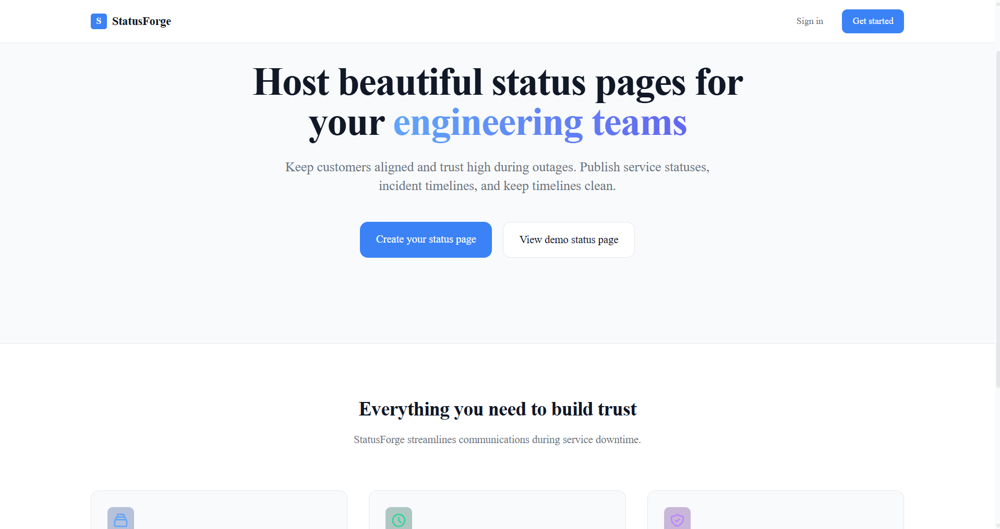
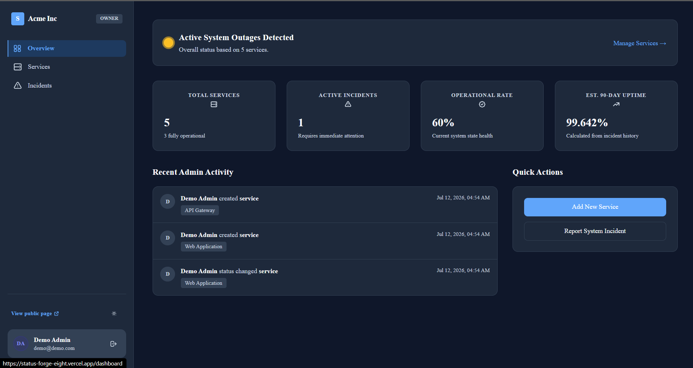
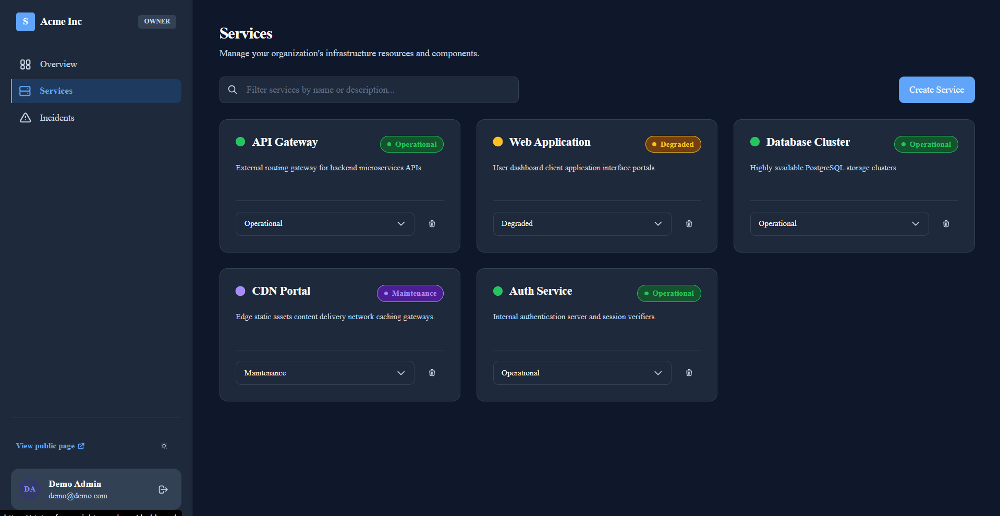
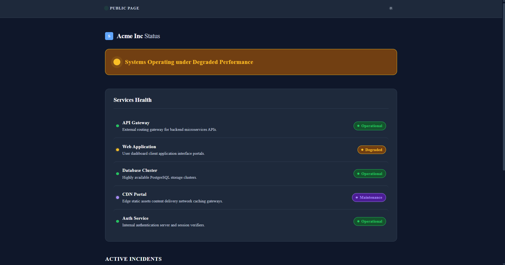
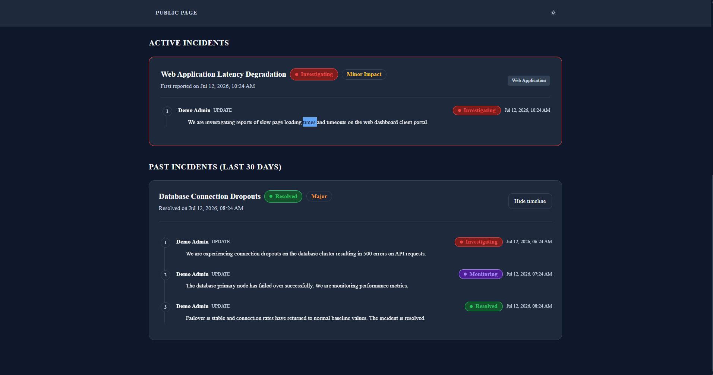

# StatusForge
> Public status pages with incident timelines for engineering teams.



[](https://github.com/Sabia-12/statusforge/actions/workflows/ci.yml) [](LICENSE) **Live demo -> https://status-forge-eight.vercel.app/**

## Features

- **Create and configure status indicators** for separate microservices, databases, clusters, and CDNs.
- **Declare incident outages** with custom severity levels (none, minor, major, critical) affecting specific services.
- **Post chronological timeline updates** to incidents to log investigation steps, identified causes, and monitoring phases.
- **Resolve incidents automatically** which cascades service health indicators back to operational state.
- **Protect administrative mutations** via role-based access rules supporting Owner, Admin, Member, and Viewer permissions.
- **Trace administrative modifications** on services, status toggles, and incident details in a central audit feed.
- **Toggle color modes** with keyboard-accessible theme switchers.

## Tech Stack

Next.js · TypeScript · PostgreSQL (Prisma) · Tailwind · Auth.js · Vercel

## Quick Start

```bash
git clone https://github.com/Sabia-12/StatusForge && cd StatusForge
cp .env.example .env            # then fill in values
npm install
npm run db:migrate && npm run db:seed
npm run dev                    # http://localhost:3000
```

## Environment Variables

| Variable | Description |
| :--- | :--- |
| `DATABASE_URL` | Postgres database connection string |
| `NEXTAUTH_SECRET` | Secret token signing NextAuth JWT session keys |
| `NEXTAUTH_URL` | Application root URL for NextAuth callbacks |
| `NEXT_PUBLIC_SITE_URL` | Base public canonical URL of the application |

## Architecture

StatusForge is built using a tenant-isolated Next.js App Router pattern. Session identities carry client roles and organization contexts within signed JWT tokens to secure Server Action mutations. One diagram beats a page of prose. Read the details in [docs/architecture.md](docs/architecture.md).

## Testing

```bash
npm run test      # unit
npm run test:e2e  # playwright
```

## Roadmap

- [x] Multi-service status health indicator dashboards
- [x] Chronological incident timeline reporting with automatic cascading resolution
- [x] Role-Based Access Control credentials mapping (Owner, Admin, Member, Viewer)
- [x] Light/dark mode styling conforming to WCAG AA parameters
- [ ] Third-party Google & GitHub OAuth provider integrations
- [ ] Automatic ping health-checks triggers
- [ ] Real-time Slack and email notifications alerts on status updates

## Screenshots

*Grid of the core flows.*

| Marketing & Public Page | Admin Dashboard |
| --- | --- |
|  |  |
|  |  |

## License

MIT — see LICENSE.

---

### Demo credentials
If the app has auth, put a read-only demo login in the README. Use this to review without registering:
- **Email:** `demo@demo.com`
- **Password:** `demo1234`
