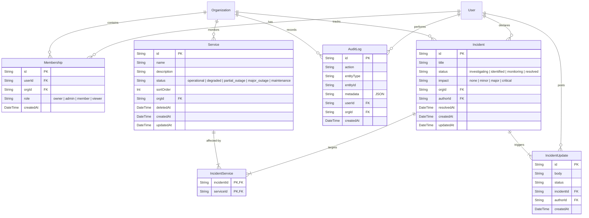

# StatusForge — Architecture

StatusForge is designed as a modular, monolithic Next.js application using Server Components, Server Actions, and a relational database.

---

## Entity Relationship Diagram (ERD)

The following Mermaid diagram outlines the relational structure of the database:

---

## Authentication & Role-Based Access Control (RBAC)

StatusForge handles session identity via **NextAuth.js v4** using the Credentials Provider. 

1. **Session Carry-on:** During authentication, a JWT is generated. The custom callbacks in `src/lib/auth.ts` carry the user's `userId`, `orgId`, `role` (from `Membership`), and `orgSlug` directly inside the session object. This avoids repetitive database joins on subsequent requests.
2. **Access Guards:**
   - Client pages and navigation paths are checked via `src/middleware.ts` to redirect unauthenticated requests to `/login`.
   - Server Actions employ backend guards using `requireRole()` and custom role permissions (`canWrite`, `canAdmin`) to enforce database writes strictly based on RBAC, preventing unauthorized or forged POST actions.

---

## Technical Trade-offs & Rationale

### 1. SQLite (Development) vs PostgreSQL (Production)
- **Trade-off:** Using SQLite locally while expecting PostgreSQL in staging/production.
- **Rationale:** SQLite is a zero-configuration, file-based database that accelerates development setup by bypassing the need for docker containers or local database provisioning. Prisma abstracts the SQL differences cleanly, making it trivial to swap the datasource provider in `schema.prisma` for production deployment without changing query logic.

### 2. In-Memory Rate Limiter vs Redis-backed Limiters
- **Trade-off:** Sliding window logs are kept in a local NodeJS Map memory cache rather than a persistent storage server like Redis.
- **Rationale:** To keep the MVP configuration lightweight and reduce infrastructure overhead, an in-memory sliding window checks rate limits. This performs fast operations without extra networking dependencies. For scaled, multi-instance production deployments (e.g. Serverless Vercel functions), memory states do not persist between requests, making a Redis-backed token bucket or Upstash store the logical upgrade path.

### 3. JWT Sessions vs Database Sessions
- **Trade-off:** Session validation relies on signed JWT signatures rather than storing session ID tables in the SQLite database.
- **Rationale:** Storing credentials-based sessions in the database requires queries on every page request. JWT sessions store signed claims on the client, shifting the verify step to stateless CPU checks. This increases scalability, reduces DB read IOPS, and fits Edge-rendered functions.
