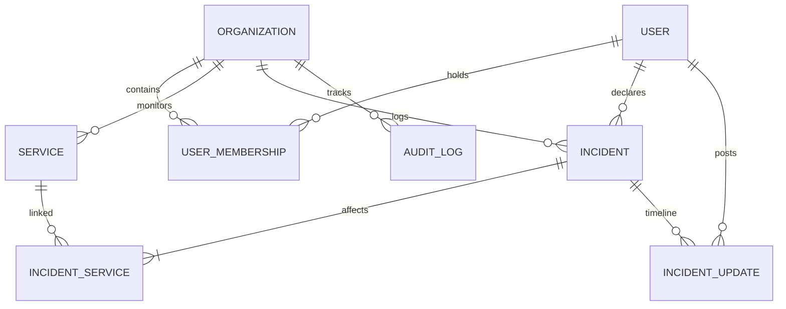

# Case Study: StatusForge
*A production-grade, tenant-isolated status page dashboard and incident communication platform.*

---

## 1. The Problem

For modern SaaS companies, service reliability is a product feature. However, proprietary status page tools (like Atlassian Statuspage) are expensive, feature-bloated, and difficult to manage programmatically. When an outage occurs, engineering teams face two core pains:
1. **Internal Friction:** Manually updating separate component indicators while coordinating triage.
2. **External Friction:** Keeping users informed in real-time to prevent support ticket spikes.

**StatusForge** solves this by providing a lightweight, tenant-isolated, open-source status page engine. It allows engineering organizations to report incident timelines, automatically cascade component outages, and present a clean, accessible public dashboard to their visitors.

---

## 2. The Approach

### Technical Stack & Key Decisions
- **Framework:** **Next.js 14 (App Router)** for unified server-rendered layout speed and client-side page state transitions.
- **Database Mapping:** **Prisma** with **PostgreSQL** (with SQLite local fallback). A normalized relational model bridges `Organization` contexts down to `Services`, `Incidents`, `IncidentUpdates`, and `AuditLogs`.
- **Authentication:** **Auth.js (NextAuth.js)** mapping session contexts directly to client roles (Owner, Admin, Member, Viewer) in encrypted JWTs.
- **Form validation:** **Zod** schema validations on the server side to enforce strict bounds on input payloads.
- **Styling:** **Tailwind CSS + CSS Custom Properties** to form a theme system supporting seamless dark mode transitions and WCAG AA color ratios.

### Relational Data Model (ERD Summary)

### Architectural Trade-offs
- **In-Memory Rate Limiting:** We selected a sliding-window memory store for requests validation. For single-instance or basic deployments, this eliminates Redis overhead, though it would be migrated to a distributed Redis cluster for horizontal production scaling.
- **Next.js revalidatePath over WebSockets:** To ensure real-time status page updates, we utilized Next.js route revalidation on incident writes. This leverages HTTP caching infrastructure (CDN) and avoids the stateful connection limits of WebSockets.

---

## 3. The Result

The final product delivers an extremely clean dashboard interface matching the aesthetics of Linear and Stripe:
- **Automatic Cascades:** Declaring a major/critical incident automatically downgrades affected service nodes (e.g., API Gateway -> Degraded). Resolving the incident restores services back to `Operational`.
- **RBAC Controls:** Read-only members can view logs; members can update status; only owners/admins can delete core service resources.
- **Accessibility Integration:** Conforms to WCAG AA parameters, provides focus outlines for keyboard navigation, supports screen reader ARIA hooks, and checks `prefers-reduced-motion` to disable animations.

---

## 4. What Was Learned

- **Server Actions & Optimistic State:** Coordinating local React states (e.g., toggling a service status dropdown) with asynchronous server actions requires careful optimistic state rollbacks on network failures to preserve a smooth user experience.
- **Next.js Prerendering Boundaries:** Hooks like `useSearchParams()` can break static builds during optimization stages. Wrapping components in explicit `<Suspense>` boundaries is crucial for maintaining proper Next.js static bailing paths.
- **Tailwind with HSL tokens:** Relying on Tailwind variables mapped to arbitrary CSS variables (`bg-[var(--surface)]`) creates an maintainable foundation for dual-theme color coordination.
